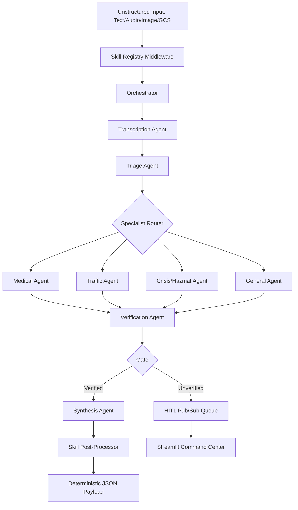

# Omni-Bridge System Architecture

Omni-Bridge is a **Multimodal Incident Orchestrator** designed for high-stakes mission-critical environments. It bridges the gap between unstructured real-world chaos (voice, text, images) and structured, deterministic system execution.

## 1. High-Level Design Pattern
The system follows an **Agentic Mesh Architecture** (inspired by ADK principles but implemented natively on Vertex AI). It uses a sequential, multi-agent pipeline where each step is handled by a specialized, autonomous agent.

## 2. The 5-Step Agentic Pipeline

### Step 0: Transcription Agent (`backend/agents/transcription.py`)
- **Modality**: Audio/GCS URI.
- **Model**: `gemini-2.5-flash`.
- **Function**: Converts messy audio/radio logs into structured text context without intermediate Whisper dependencies.

### Step 1: Modality Triage & Intent Agent (`backend/agents/triage.py`)
- **Modality**: Text/Image.
- **Model**: `gemini-2.5-flash-lite` (Optimized for speed).
- **Function**: Extracts domain (Medical/Traffic/etc.), initial urgency (DEFCON rating), and key variables from raw context.

### Step 2: Domain Specialist Agents (`backend/agents/[medical|traffic|crisis].py`)
- **Modality**: Triaged Data + Raw Context.
- **Model**: `gemini-2.5-flash` (Optimized for quality).
- **Function**: Deep extraction of domain-specific entities (e.g., patient vitals, GPS coordinates, hazmat hazard levels).

### Step 3: Verification Agent (`backend/agents/verify.py`)
- **Type**: **Deterministic Rule-Based Logic**.
- **Function**: The anti-hallucination gate. It checks for critical missing data points (e.g., dosage counts, location clarity). If the gate fails, the incident is flagged for **Human-In-The-Loop (HITL)**.

### Step 4: Synthesis Agent (`backend/agents/synthesis.py`)
- **Type**: Orchestrated Payload Generation.
- **Model**: `gemini-2.5-flash`.
- **Function**: Assembles a deterministic, schema-validated JSON payload ready for downstream systems.

## 3. Cognitive Skill Middleware
The architecture supports optional, stateless Cognitive Skills (`X-Omni-Skills`) that mutate the execution context dynamically.
- `SecurityGovernanceSkill`: Real-time PII and PHI regex scrubbing.
- `MemoryManagementSkill`: Long-term and Short-term context sliding windows.

## 4. Deployment & Infrastructure
- **Compute**: Google Cloud Run (Serverless) and Google Kubernetes Engine (GKE) (High-Availability).
- **Auth**: Google Identity Services (SSO frontend) and Application Default Credentials (ADC backend).
- **Events**: Cloud Pub/Sub for unverified incident escalation.
- **HITL Resolution**: Streamlit dashboard pulling off `omnibridge-hitl-queue` for manual operator override.
- **Storage**: GCS-native ingestion for large-scale multimodal data processing.
